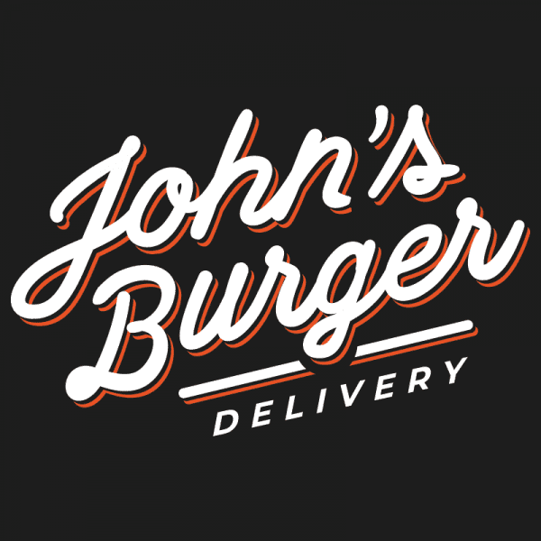

<div align="center" style="margin-bottom: 2rem;">
  
</div>

<h1 align="center">
  John's Burguer 🍔
</h1>

<div align="center">
   <a href="https://github.com/JohnPetros">
      
   </a>
   
   <a href="https://github.com/JohnPetros/johns-burguer/commits/main">
      
   </a>
  </a>
   </a>
   <a href="https://github.com/JohnPetros/johns-burguer/blob/main/LICENSE.md">
      
   </a>
    
</div>
<br>

## 🖥️ About the project

John's Burguer is a web application to delivery fast food across the world.

As a delivery app the user can add menu items to cart and fill in their transaction data such as address and payment method on checkout to finish their order. Also the user can create a custom burguer with ingredients of their choise.

The goal of developing this project was learn the basic features of [Astro](https://astro.build/), an amazing web framework for content-driven websites

### ⏹️ Demonstration

<table align="center">
  <tr>
    <td align="center" width="1000">
      
    </td>
    <td align="center" width="1000">
      
    </td>
  </tr>
  <tr>
    <td align="center" width="1000">
      
    </td>
    <td align="center" width="1000">
      
    </td>
  </tr>
</table>


---

## ✨ Features

### ✅ Functional features

#### Home section

- [x] Should display a CTA (call to action) to the user

#### About section

- [x] Should display the background history about John's Burguer Delivery

#### Menu section

- [x] All food items of John's Burguer Delivery should be list on a menu section
- [x] The food items should be categorized in:
  - burguers
  - drinks
  - deserts
- [x] The user should be able to filter the menu by each category listed above
- [x] Each food item should be displayed as a card showing:
    - image
    - name
    - price
- [x] The user should be able to access the cart from the food item card
    
#### Contact section

- [x] Should be provided a contact form for the user
- [x] The contact form shold have the fields:
    - name
    - email
    - message
- [x] Should display a map illustraring the delivery app's address

#### Navigation bar

- [x] Should provide a bar to the user can navigate across the main page 
- [x] The navigation bar should have link to each section of the main page

#### Cart

- [x] The user should be able to add a food item to cart
- [x] Before adding the item to cart the user should add condiments for the food item
- [x] The food item's condiments should be related to its category
- [x] Each condiment should have options
- [x] The user should pick only one option to add the condiment  
- [x] The user should be able to edit the added food item  
- [x] The user should be able to emove the added food item  
- [x] The cart should display a table containing each added food item and showing for each of them:
    - quantity
    - name
    - total price and unit price
    - action buttons to edit or remove the item 
- [x] The cart should display the total cost considering all items

#### Checkout

- [x] The user should be able to fill in their data to a transaftion form
- [x] The payment method shoould be only by credit card
- [x] The checkout form should have the fields:
    - E-mail
    - Name
    - Address
        - city
        - country
        - street
        - number
        - zipcode
        - state
    - Credit card
        - number
        - expiration
        - CVC
- [x] The cart should be shown on the checkout page having keeping its features

#### Custom burguer

- [x] The user should be able to create a custom burguer adding ingredient to form it
- [x] The ingredients should be categorized in:
    - Sauce
    - Meat
    - Cheese
    - Vegetable
- [x] The user should only add one ingredient at a time
- [x] The user should be able to remove the added ingredient
- [x] The total cost of the custom burguer should be calculated as the user add an ingredient

### ☑️ Nonfunctional features

#### Cart

- [x] The items on the cart should be persistive
- [x] The option of each condiment should be clearly highlighted on the form
- [x] The total price of the cart should be highlighted to the user
- [x] The user should be alerted before deleting an item

#### Checkout

- [x] The checkout form should not be fully loaded (the user address should be filled first and then their payment method data) 
- [x] The user should not access the checkout if it is impossible to complete a payment. E.g.: if the cart is empty, then the user cannot complete a payment
- [] Should persist user data if they are already a customer, that is, they have already purchased something from John's Burguer Delivery

#### Custom burguer

- [x] The user should be alerted before going to the checkout after completing their burguer
- [] The user should be alerted before leave the custom burguer section

#### Layout

- [x] The layout should be responsive to multiple devices screens
- [x] The layout should have a color pallete facing the orange, which is related to the fast food context 

#### Accessebility

- [x] Should use semantic HTML tags when is possible
- [x] The components that requires user interactivity should comply the accessibility rules proposed by [WAI (web accessibility initiative)](https://www.w3.org/WAI/)

---

## ⚙️ Architecture

## 🛠️ Technologies, tools and services

This project was developed using the following technologies:

- **[Astro](https://astro.build/)** to build the server, pages and static components

- **[React](https://tailwindcss.com/)** to build interactive components

- **[TailwindCSS](https://tailwindcss.com/)** to style the app

- **[Preline UI](https://preline.co/)** to build static accessible ui components with tailwindCSS

- **[Headless UI](https://headlessui.com/)** to build interactive accessible ui components with React 

- **[Radix UI](https://headlessui.com/)** to build accessible form components with React

- **[Framer Motion](https://htmx.org/)** to animate React components

> For more details about the project's dependencies like specifi versions of each dependency, se [package.json](https://github.com/JohnPetros/johns-burguer/blob/main/package.json)

---

## 🚀 How to run the application?

### 🔧 Prerequisites

Before download the prject you will need install some tools:

- [Git](https://git-scm.com/)
- [npm](https://nodejs.org/en), [yarn](https://nodejs.org/en) or [pnpm](https://pnpm.io/pt/) (I'll use pnpm)

> Besides that, it is good to have some tool to write the code like [VSCode](https://code.visualstudio.com/)

> Also it is pivotal setting the environment variables on the `.env` file before running the application. See the [.env.example](https://github.com/JohnPetros/johns-burguer/blob/main/.env.example) file to know which variables should be set

### 📟 Running the aplication

```bash

# Clone this repo
$ git clone https://github.com/JohnPetros/johns-burguer.git .

# Install the dependencies
$ pnpm install

# Run the application on a development environment
$ pnpm dev

```

> Probably the aplication will be running on http://localhost:4321

---

## 🚚 Deploy

This application's deploy was made using **[Netlify plataform](https://www.netlify.com/)**, which means you can use the running application accessing this **[link](https://johns-burguer.netlify.app/)**.

---

## 🤝 how to Contribute

```bash

# Fork this repo
$ git clone https://github.com/JohnPetros/johns-burguer.git

# Create a nem branch for the new feature
$ git checkout -b new-feature

# Commit your changes:
$ git commit -m 'feat: <New Feature>'

# Push your branch:
$ git push origin new-feature

```

> You must replace new-feature with the name the feature you are adding

> You can also open a [new issue](https://github.com/JohnPetros/johns-burguer/issues) about some problem, question or sugestion for the project. I will be happy to help as well as improve this application

---

## 📝 Licença

This application is under MIT Licence. See [the licence file](LICENSE) to get more details about it.

---

<p align="center">
  Made with 💜 by John Petros 👋🏻
</p>
